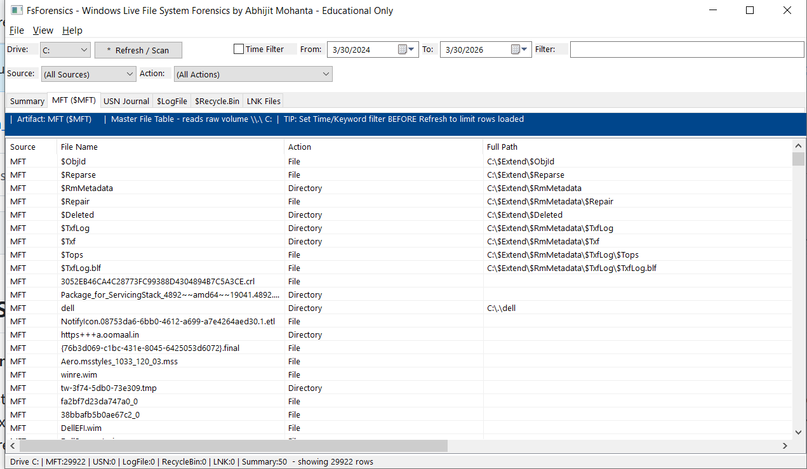

# FsForensics — Windows Live File System Forensics Viewer

**By Abhijit Mohanta** | Educational Use Only

FsForensics is a standalone Windows forensic tool that reads NTFS artifacts **directly from the live file system** — no third-party libraries, no installation, no external dependencies. It reads the raw volume (`\\.\C:`) to bypass Windows file access restrictions and parse NTFS internal structures that are normally inaccessible.

> ⚠️ **Requires Administrator privileges.** Raw volume access is needed to read `$MFT`, `$LogFile`, `$UsnJrnl`, and other NTFS metadata files that Windows locks from normal userspace access.

---

## Screenshot

---

## Key Features

- **Zero dependencies** — single portable EXE, no install, no DLLs, no runtime required
- **Live system analysis** — reads directly from `\\.\C:` raw volume handle
- **Full path resolution** — walks the MFT parent chain to reconstruct complete file paths for every artifact
- **Per-tab auto-scan** — click a tab and it scans that artifact automatically
- **Time filter** — filter all artifacts by date/time range before or after scanning
- **Keyword filter** — real-time search across filename, path, action, and extra fields
- **Action / Source column filters** — dropdown filter by operation type or artifact source
- **Export** — CSV and HTML export for current tab; bulk export all tabs to separate CSV files
- **Virtual ListView** — handles millions of rows without slowdown (O(1) rendering)
- **Background scanning** — non-blocking UI with progress indicator and Stop button

---

## Artifacts Parsed

### Summary Tab
Quick overview of the last 50 deleted files and last 50 created files across all loaded artifacts. Filters out temp folders automatically. Useful as a starting point in an investigation.

### MFT — Master File Table (`$MFT`)
Reads the raw MFT from the volume. Every file and directory on the NTFS volume has an MFT record — including deleted files whose records haven't been reused yet.

- File name, full path, size, created/modified/accessed/MFT-modified timestamps
- File vs directory, in-use vs deleted status
- MFT record number, file attributes, sequence number
- Full path resolved by walking parent record chain

### USN Journal (`$Extend\$UsnJrnl:$J`)
The USN (Update Sequence Number) Change Journal records every file system operation. Reads via raw volume using `FSCTL_READ_USN_JOURNAL`.

- File create, delete, rename (old name + new name), data write, attribute change
- Timestamps for each operation
- Full path resolved via MFT parent map (auto-built if MFT tab not yet scanned)
- File reference numbers

### $LogFile — NTFS Transaction Log
The NTFS transactional log records low-level metadata operations used for crash recovery. FsForensics reads it via MFT record #2 data runs (direct raw cluster reads) — the only method that works on a live Windows 10/11 system.

- Forensically significant operations only: file create, delete, rename, attribute update, directory entry add/remove, data mapping changes
- Redo and Undo operation names per transaction
- LSN (Log Sequence Number) and Transaction ID
- Affected filename and full path (resolved via MFT parent map)

### $Recycle.Bin
Parses `$I` metadata files from all user SID subfolders under `C:\$Recycle.Bin`. Supports both v1 (Vista/Win7) and v2 (Win8/10/11) `$I` file formats.

- Original full path of the deleted file
- File size at time of deletion
- Deletion timestamp
- User SID folder and `$I` filename

### LNK Files — Shortcut Files
Scans all `.lnk` shortcut files from user profile locations (`Recent`, `Desktop`, `AppData`, Startup folders). LNK files are created automatically by Windows when a user opens a file — making them key evidence of file access.

- Target file path (Unicode `LocalBasePathOffsetUnicode` preferred, ANSI fallback)
- LNK file name (evidence of which file was accessed)
- Created, Modified, Accessed timestamps of the LNK file
- File size of the target at time of last access
- File attributes

---

## Forensic Value

| Artifact | What it proves |
|---|---|
| MFT | File existed / was deleted; exact timestamps; full path |
| USN Journal | File was created, renamed, or deleted with timestamp |
| $LogFile | Low-level NTFS operations; timestamp manipulation detection |
| $Recycle.Bin | File was deliberately deleted; original path; when |
| LNK Files | User accessed a file; from where; when |

---

## Usage

1. **Run as Administrator** (required for raw volume access)
2. Select drive letter from the **Drive** dropdown (default: C:)
3. Optionally set a **Time Filter** date range and/or **keyword** before scanning
4. Click any tab — it auto-scans that artifact immediately
5. Use **Action** and **Source** dropdowns to filter results
6. Right-click or use **File** menu to export

**Tip:** Scan the **MFT tab first** for the best full path resolution across all other tabs. FsForensics will auto-build a path map if needed, but scanning MFT explicitly gives the most complete results.

---

## Filters

| Filter | How it works |
|---|---|
| Time Filter | Applied at scan time — limits rows loaded from disk |
| Keyword | Applied at scan time — searches filename, path, action, extra |
| Action dropdown | Applied after scan — filter by operation type |
| Source dropdown | Applied after scan — filter by artifact source |

---

## Export

- **File → Export to CSV** — exports current tab (selected rows or all visible rows)
- **File → Export to HTML** — same as CSV but as a styled HTML table
- **File → Export All Tabs to CSV** — exports every loaded tab to a separate CSV file in a chosen folder:
  - `FsForensics_Summary.csv`
  - `FsForensics_MFT.csv`
  - `FsForensics_USNJournal.csv`
  - `FsForensics_LogFile.csv`
  - `FsForensics_RecycleBin.csv`
  - `FsForensics_LNKFiles.csv`

---

## System Requirements

| Requirement | Detail |
|---|---|
| OS | Windows 10 / Windows 11 (64-bit) |
| Privileges | Administrator |
| File system | NTFS volumes only |
| Runtime | None — fully standalone EXE |
| Installation | None — just run the EXE |

---

## Disclaimer

This tool is provided **for educational and research purposes only**. Only use it on systems you own or have explicit written permission to examine. The author is not responsible for any misuse.

---

*FsForensics — Windows Live File System Forensics by Abhijit Mohanta*
