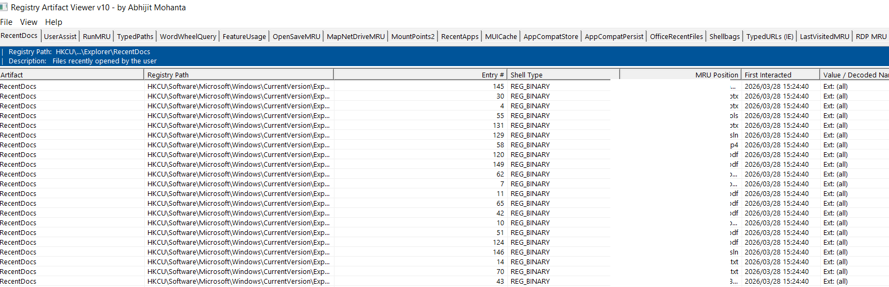

# Registry Artifact Viewer
### By Abhijit Mohanta



> A pure **Win32 / VC++** Windows forensics tool that reads, decodes, and displays **18 registry artifacts + 4 SRUM tables** from a live system — with no external dependencies, no MFC, no installers.

---

## Features

- **22 forensic artifact tabs** — registry + SRUM in one tool
- **Live registry reads** from `HKCU` on startup — no file import needed
- **SRUM parsing** via raw disk copy + ESE/JET API (requires Admin)
- **Shellbag full decode** — folder names, shell type, MRU position, Created/Modified/Accessed timestamps
- **UserAssist ROT13 decode** — run count, last run time, session ID
- **OpenSaveMRU / LastVisitedPidlMRU** — PIDL resolved to real paths via Shell API
- **Info bar** on every tab showing exact registry hive path and forensic description
- **Quick Filter** (Ctrl+Q) — instant search across all columns
- **Column sort** — click any header
- **Export** — CSV, HTML, XML per tab or all artifacts at once
- **Copy** — Ctrl+C copies selected rows (tab-delimited, pastes into Excel)
- **Column width persistence** across sessions (registry)
- Pure Win32 — **no MFC required**, builds with any VS2022 Community install

---

## Artifact Reference

### User Activity

| Tab | Registry Path | What It Reveals |
|-----|--------------|-----------------|
| **RecentDocs** | `HKCU\...\Explorer\RecentDocs` | Files recently opened by the user, per extension. Evidence of file access even if file is deleted. |
| **UserAssist** | `HKCU\...\Explorer\UserAssist\{GUID}\Count` | Every GUI program launched — run count, last run timestamp, session ID. ROT13 decoded. |
| **RunMRU** | `HKCU\...\Explorer\RunMRU` | Commands typed into Start → Run dialog. Exact paths to executables and scripts. |
| **TypedPaths** | `HKCU\...\Explorer\TypedPaths` | Paths manually typed into the Explorer address bar. Proves deliberate navigation. |
| **WordWheelQuery** | `HKCU\...\Explorer\WordWheelQuery` | Search terms typed into the Explorer search box. |
| **FeatureUsage** | `HKCU\...\Explorer\FeatureUsage` | Windows UI feature usage (taskbar, jump lists). Corroborates activity timeline. |
| **OpenSaveMRU** | `HKCU\...\ComDlg32\OpenSavePidlMRU` | Files accessed via Open/Save dialogs in any app. Decoded from PIDL via Shell API. |
| **MapNetDriveMRU** | `HKCU\...\Explorer\Map Network Drive MRU` | Network shares connected via Map Network Drive dialog (`\\server\share`). |
| **MountPoints2** | `HKCU\...\Explorer\MountPoints2` | Every drive/volume ever mounted — USB, network, virtual. Persists after removal. |
| **RecentApps** | `HKCU\...\Search\RecentApps` | Apps recently searched/launched via Start Menu. App ID and launch count. |

### Execution Evidence

| Tab | Registry Path | What It Reveals |
|-----|--------------|-----------------|
| **MUICache** | `HKCU\...\Shell\MuiCache` | Every executable that ever ran — display name cached by Windows. Survives deletion. |
| **AppCompatStore** | `HKCU\...\AppCompatFlags\...\Store` | Programs that triggered AppCompat checks. Strong execution evidence for unusual binaries. |
| **AppCompatPersist** | `HKCU\...\AppCompatFlags\...\Persisted` | Persisted compatibility flags. Includes programs run in compatibility mode. |
| **OfficeRecentFiles** | `HKCU\Software\Microsoft\Office\[ver]\[App]\(User MRU\...)\File MRU` | Files opened in Word, Excel, PowerPoint, Access, Outlook. Supports Office 365 ADAL paths. |

### Folder Browsing

| Tab | Registry Path | What It Reveals |
|-----|--------------|-----------------|
| **Shellbags** | `HKCU\...\Shell\BagMRU` + `Bags` | Every folder browsed in Explorer — USB drives, network shares, ZIP files. Shows name, timestamps, MRU order. Persists after drive removal. |

### Browser / Web

| Tab | Registry Path | What It Reveals |
|-----|--------------|-----------------|
| **TypedURLs (IE)** | `HKCU\...\Internet Explorer\TypedURLs` | URLs manually typed into IE address bar. Proves intentional navigation. |
| **LastVisitedMRU** | `HKCU\...\ComDlg32\LastVisitedPidlMRU` | Last folder each application navigated to in Open/Save dialogs. Format: `AppName.exe` + folder PIDL. |

### Network

| Tab | Registry Path | What It Reveals |
|-----|--------------|-----------------|
| **RDP MRU** | `HKCU\...\Terminal Server Client\Default` + `Servers` | Every Remote Desktop server connected to. Evidence of lateral movement or remote access. |

### SRUM — System Resource Usage Monitor *(requires Administrator)*

| Tab | Source | What It Reveals |
|-----|--------|-----------------|
| **SRUM App Usage** | `SRUDB.dat` `{5C8CF1C7...}` | Per-app CPU time, foreground/background cycles, bytes read/written. Up to 60 days history. |
| **SRUM Network** | `SRUDB.dat` `{973F5D5C...}` | Per-app bytes sent and received per network interface. Identifies data exfiltration. |
| **SRUM Net Conn** | `SRUDB.dat` `{DD6636C4...}` | Per-app network connection duration per interface type. |
| **SRUM Energy** | `SRUDB.dat` `{FEE4E14F...}` | Per-app energy/power usage events. Correlates with CPU-intensive activity. |

> SRUM data is parsed from `C:\Windows\System32\sru\SRUDB.dat` using raw cluster-level disk copy (embedded RawCopy logic) + Windows ESE/JET API. The temporary copy is deleted after parsing.

---

## Columns

| Column | Meaning |
|--------|---------|
| **Artifact** | Artifact category name |
| **Registry Path** | Full `HKCU\...` path of the key |
| **Entry #** | Value name or entry number |
| **Shell Type** | Decoded shell item type (Directory, Drive letter, Root folder: GUID, etc.) |
| **MRU Position** | Most-recently-used rank (0 = most recent) |
| **First Interacted** | Key last-write time / first interaction timestamp |
| **Value / Decoded Name** | Decoded value — folder name, app name, file path, ROT13 result |
| **Created On** | File/folder creation timestamp (from shell item or LNK) |
| **Modified On** | File/folder modification timestamp |
| **Accessed On** | File/folder last-accessed timestamp |
| **Last Interacted** | Last time the item was interacted with |

---

## Build Instructions

**Requirements:**
- Visual Studio 2022 (Community, Professional, or Enterprise)
- Workload: **Desktop development with C++**
- No MFC required — pure Win32

**Steps:**
```
1. Clone the repository
2. Open  RegistryArtifactViewer.sln  in Visual Studio 2022
3. Select  Release | x64
4. Build → Build Solution  (Ctrl+Shift+B)
5. Output: bin\x64\Release\RegistryArtifactViewer.exe
```

No additional files or DLLs needed. The executable is self-contained.

---

## Usage

1. **Run as Administrator** (required for SRUM tabs and MountPoints2)
2. The tool auto-scans the current user's registry on startup
3. Click any tab to view that artifact
4. Use **Ctrl+Q** to activate the quick filter — type to instantly narrow results
5. Click column headers to sort
6. Right-click for export and copy options
7. **File → Export All Artifacts to CSV** dumps all 22 tabs into one file

---

## Keyboard Shortcuts

| Shortcut | Action |
|----------|--------|
| `Ctrl+Q` | Toggle Quick Filter |
| `Ctrl+A` | Select All |
| `Ctrl+C` | Copy Selected (tab-delimited) |
| `F5` | Refresh All Artifacts |
| `Enter` | Open Properties for selected row |

---

## Forensic Notes

- Most artifacts **persist after file deletion**, program uninstall, and browser history clearing
- Data is read from `NTUSER.DAT` (loaded as live `HKCU`) — always reflects the **logged-in user**
- To analyze **another user's hive**, load their `NTUSER.DAT` via `reg load` and point the tool to that hive
- SRUM covers approximately **30–60 days** of application activity regardless of log clearing
- Shellbag entries for **removed USB drives** remain until the BagMRU entries are manually deleted

---

## License

For educational and forensic research purposes.  
Built with pure Win32 API — no third-party libraries.

---

*Registry Artifact Viewer — Windows Forensics Tool*  
*By Abhijit Mohanta*
