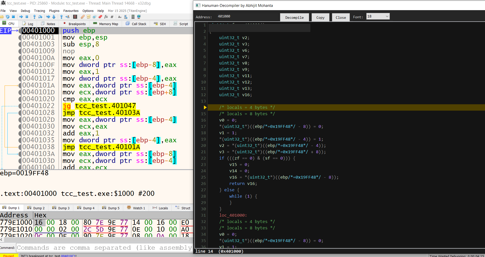

 Hanuman Decompiler Plugin for x64dbg# 

**Hanuman** is a lightweight decompiler plugin for **x64dbg** that enables **live decompilation while debugging**. It helps reverse engineers quickly understand assembly by translating it into higher-level representations during runtime.

---

## ✨ Features

- ⚡ Live Decompilation during debugging
- 🧠 Simplified view of assembly instructions
- 🔍 Helps speed up malware analysis & reverse engineering
- 🪶 Lightweight and easy to integrate
- 🧩 Works seamlessly with x32 & x64 versions of x64dbg

---

## 📦 Installation

1. Download or clone this repository.

2. Copy the plugin files to your x64dbg plugin directory:

<x64dbg_folder>\release\<x32/x64>\plugins\

3. Place the following files accordingly:

Hanuman.dp32  
Hanuman.dp64  
api_defs.txt  

---

## 📁 Example Directory Structure

x64dbg/
└── release/
    ├── x32/
    │   └── plugins/
    │       ├── Hanuman.dp32
    │       └── api_defs.txt
    └── x64/
        └── plugins/
            ├── Hanuman.dp64
            └── api_defs.txt

---

## 🚀 Usage

1. Launch x64dbg
2. Load your target binary
3. Start debugging
4. Go to plugin's menu choose hanuman-decompiler

---

## 🧠 Why Hanuman?

Reverse engineering often requires mentally converting assembly into higher-level logic.  
Hanuman simplifies this process, allowing you to:

- Focus on logic instead of instructions
- Speed up malware analysis
- Improve productivity during debugging sessions

---

## ⚠️ Notes

- Ensure correct architecture placement:
  - dp32 → x32 folder  
  - dp64 → x64 folder  
- api_defs.txt must be present for proper API interpretation

## 🚧 Work To Be Done

- More code pattern recognitions  
- Adding recognition to multiple coding convention  

## 🔥 Inspiration
Ghidra, Snowman

Built for reverse engineers, malware analysts, and detection engineers who want faster insight during debugging.
