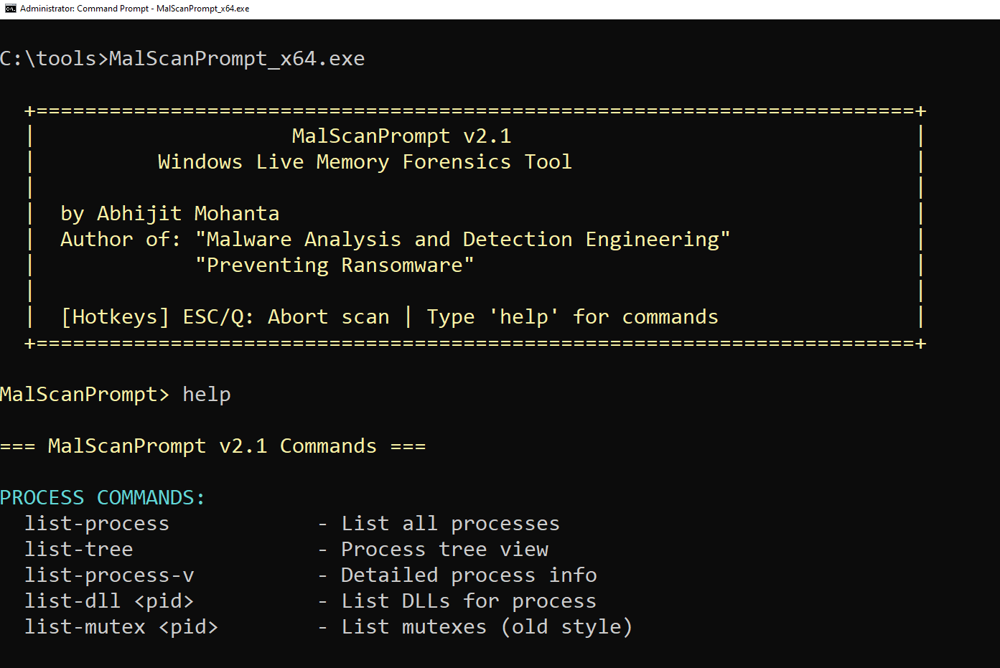

# MalScanPrompt v2.1

<p align="center">
  
</p>

## Windows Malware Analysis & Detection Tool

**MalScanPrompt** is a powerful command-line tool for malware analysts, incident responders, and security researchers. It can be a considered as a user mode LIVE MEMORY FORENSICS TOOL. It provides comprehensive process inspection, code injection detection, mutex hunting, YARA scanning, and system anomaly detection capabilities.

### Author

**Abhijit Mohanta**
- Author of *"Malware Analysis and Detection Engineering"*
- Author of *"Preventing Ransomware"*

---

## Features

- 🔍 **Process Enumeration** - List processes, DLLs, handles, mutexes, and named pipes
- 💉 **Injection Detection** - Scan for code injection (RWX memory, shellcode signatures)
- 🎯 **Mutex Hunting** - Hunt malware by mutex patterns with wildcard support
- 🦠 **YARA Scanning** - Scan running processes with YARA rules
- ⚠️ **Anomaly Detection** - Detect suspicious process counts, parent-child relationships, DLL hijacking
- 🌳 **Process Tree** - Visualize process hierarchy
- 💾 **Memory Dumping** - Dump suspicious memory regions for analysis

---


## Requirements

- Windows 10 
- Administrator privileges (required for process inspection)
- Requires yara binaries and rules for yara scanning


---

## Quick Start

1. Download `MalScanPrompt.exe`
2. Run as Administrator
3. Type `help` to see all commands

```
MalScanPrompt> help
```

---

## Commands Reference

### Process Commands

| Command | Description |
|---------|-------------|
| `list-process` | List all running processes |
| `list-tree` | Display process tree hierarchy |
| `list-process-v` | Detailed process listing with memory info |
| `list-dll <PID>` | List DLLs loaded by a process |

**Example:**
```
MalScanPrompt> list-process
MalScanPrompt> list-dll 8144
```

---

### Handle & Object Commands

| Command | Description |
|---------|-------------|
| `list_handles [PID]` | List all handles (system-wide or per process) |
| `list_mutex [PID]` | List all mutexes (system-wide or per process) |
| `list_named_pipes [PID]` | List named pipes (system-wide or per process) |

**Example:**
```
MalScanPrompt> list_mutex
MalScanPrompt> list_mutex 8144
MalScanPrompt> list_named_pipes
```

---

### Malware Hunting

#### Mutex Hunting

Hunt for malware based on known mutex patterns.

| Command | Description |
|---------|-------------|
| `hunt_by_mutex <pattern>` | Hunt by single mutex pattern |
| `hunt_by_mutex -f <file>` | Hunt using patterns from file |

**Single Pattern Examples:**
```
MalScanPrompt> hunt_by_mutex Remcos
MalScanPrompt> hunt_by_mutex Rmc*
MalScanPrompt> hunt_by_mutex *Emotet*
```

**Pattern File Example:**
```
MalScanPrompt> hunt_by_mutex -f malware_mutex.txt
```

**Pattern File Format (`malware_mutex.txt`):**
```
# Malware Mutex Patterns
# Format: MalwareName->MutexPattern

RemcosRAT->Rmc*
Babuk_Ransom->babuk_*
BoratRAT->BoratRatMutex*

```

**Wildcard Support:**
| Wildcard | Meaning |
|----------|---------|
| `*` | Match any characters (zero or more) |
| `?` | Match single character |
| No wildcard | Substring match (contains) |

---

#### YARA Scanning

Scan all running processes with YARA rules.

```
MalScanPrompt> yarascan
```

The tool will prompt for:
1. **YARA binary path** (e.g., `C:\tools\yara64.exe`)
2. **YARA rules folder** (e.g., `C:\rules\`)

The tool automatically finds all `.yar` and `.yara` files in the specified folder.

**Example Output:**
```
=== YARA PROCESS SCANNER ===

Enter YARA binary path: C:\tools\yara64.exe
Enter YARA rules folder: C:\rules

[*] Found 3 YARA rule file(s)
    - C:\rules\malware.yar
    - C:\rules\ransomware.yar
    - C:\rules\trojans.yar

[*] Scanning processes...

[!] DETECTED: PID 8144 (suspicious.exe) - Rule: Remcos_RAT

=== YARA SCAN RESULTS ===

[DETECTION] PID: 8144 | Process: suspicious.exe
  Rule File: malware.yar
  Matched:   Remcos_RAT

[*] Total detections: 1
```

---

### Injection Detection

| Command | Description |
|---------|-------------|
| `scan-inject <PID>` | Scan single process for injection |
| `scan-inject-systemwide` | Scan ALL processes for injection |
| `dump-mem <PID> <addr>` | Dump memory region |

**Example:**
```
MalScanPrompt> scan-inject 8144
MalScanPrompt> scan-inject-systemwide
MalScanPrompt> dump-mem 8144 0x7FF612340000
```

**Detection Signatures:**
- PE Header (MZ)
- x86/x64 Function Prologue
- etc

---

### Anomaly Detection

| Command | Description |
|---------|-------------|
| `list_suspicious_process_all` | Run all anomaly checks |
| `check_susp_ProcCount` | Check for duplicate system processes |
| `check_susp_ParentChildRelation` | Check svchost parent relationships |
| `check_susp_TempAppdata` | Find processes running from Temp/AppData |
| `check_susp_DLLHijack` | Detect potential DLL hijacking |

**Example:**
```
MalScanPrompt> list_suspicious_process_all
```

**Checks Performed:**
- Multiple instances of `lsass.exe`, `services.exe`, `csrss.exe`
- `svchost.exe` with wrong parent process
- Executables running from `%TEMP%` or `%APPDATA%`
- DLLs loaded from non-standard locations shadowing system DLLs

---

## Usage Examples

### Scenario 1: Quick Malware Hunt
```
MalScanPrompt> hunt_by_mutex Rmc*   
(Remcos RAT has a mutex that starts with Rmc) 

```

### Scenario 2: Comprehensive Scan
```
MalScanPrompt> list_suspicious_process_all
MalScanPrompt> scan-inject-systemwide
MalScanPrompt> yarascan
```

### Scenario 3: Investigate Specific Process
```
MalScanPrompt> list_mutex 8144
MalScanPrompt> list_handles 8144
MalScanPrompt> list-dll 8144
MalScanPrompt> scan-inject 8144
```

### Scenario 4: Hunt with Pattern File
```
MalScanPrompt> hunt_by_mutex -f C:\patterns\rat_mutexes.txt
```

---

## Keyboard Shortcuts

| Key | Action |
|-----|--------|
| `ESC` | Abort running scan |
| `Q` | Abort running scan |
| `Ctrl+C` | Abort running scan |

---

## Command-Line Mode

Run commands directly from command prompt:

```batch
MalScanPrompt.exe list-process
MalScanPrompt.exe scan-inject 8144
MalScanPrompt.exe hunt_by_mutex Remcos
MalScanPrompt.exe yarascan
```

---

## Sample Mutex Patterns

Here are some known malware mutex patterns for hunting:

| Malware | Mutex Pattern |
|---------|---------------|
| Remcos RAT | `Rmc*`, ` |


---

## Notes

- Run as **Administrator** for full functionality
- Some processes (protected/system) cannot be accessed
- YARA scanning requires external YARA binary
- Press `ESC` or `Q` to abort long-running scans

---

## License

This software is provided as-is for security research and malware analysis purposes. Use responsibly and only on systems you have permission to analyze.

---

## Disclaimer

This tool is intended for legitimate security research, incident response, and malware analysis. The author is not responsible for any misuse of this software. Always obtain proper authorization before analyzing systems.

---

## Contact

For bug reports, feature requests, or questions, please open an issue on GitHub.

---

<p align="center">
  <b>Happy Hunting! 🎯</b>
</p>
