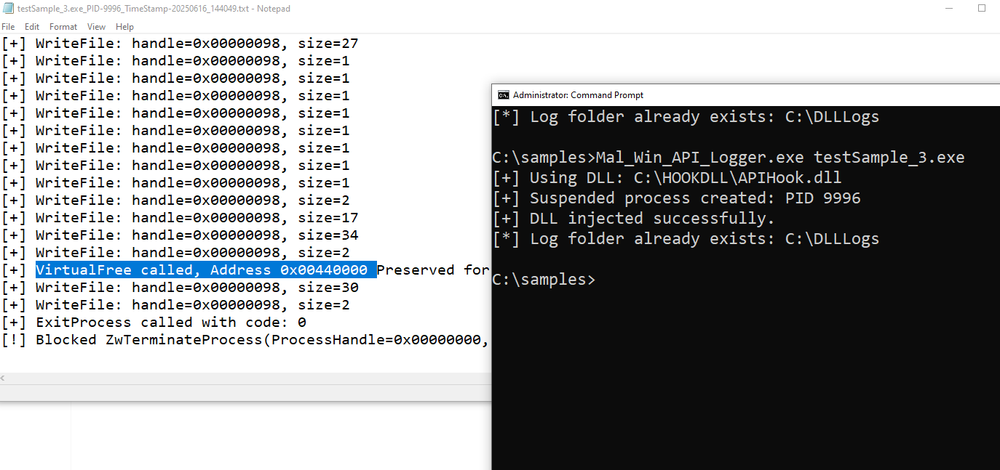

# 🛡️Malware Win32 API Logger (MalWinAPILogger)

A lightweight **Win32 API Logger** .This tool enables real-time dynamic API logging for **32-bit native Windows executables**, designed especially for malware analysts, reverse engineers, and blue teamers. Unlike sandbox-based tools, this is a **standalone command-line utility** that captures the actual behavior of malware in real execution environments.

---
## 🌟 Unique Features

- ✅ **Standalone command-line tool** — No sandbox setup needed
- ✅ **Captures API calls from malware-created processes**  
  via `CreateProcessA`, `CreateProcessW`
- ✅ **Captures API calls from injected processes**  
  via `OpenProcess` (e.g., process hollowing, DLL injection)
- ✅ **Useful to observe Packed Malware Process** 
     - ✅ **Prevents malware from terminating the process** — keeps it alive for extended inspection 
     - ✅ **Preserves memory freed by `VirtualFree()`** — useful for capturing unpacked/decrypted code
 -✅ **Logs return address** - You can check in Debugger the address(see the previous instruction) from where API was called. Useful for **Reverse Engineers**. Make sure DLL can move is disabled in exe
- ✅ **Logs saved with .OpenWithNotepad extension to Prevent Ransomware from encrypting log files**   

---

## 🚀 How to Use

1. **Place Files Together**  
   Ensure the following files are in the same directory:
   - `Mal_Win_API_Logger.exe`
   - `APIHook.dll`

2. **Run from Administrator Command Prompt**
   ```bash
   Mal_Win_API_Logger.exe <exe_name>
   ```

   This will:
   - Copy `APIHook.dll` into `C:\HOOKDLL`
   - Launch the target executable with injected DLL
   - Begin logging API calls to `C:\DLLLogs`. Logs saved with .OpenWithNotepad extension to Prevent Ransomware from encrypting log files

---

## 📄 Log Format

Logs are saved to:

```
C:\DLLLogs
```

Each log file is named:

```
<process_name>_PID-<pid>_TimeStamp-<YYYYMMDD>_<HHMMSS>.txt
```

**Example:**
```
mini.exe_PID-9252_TimeStamp-20250616_133024.txt
```

- `mini.exe`: Name of the target executable  
- `9252`: Process ID  
- `20250616`: Date (YYYYMMDD)  
- `133024`: Time (HHMMSS, 24-hour format)

Each log contains timestamped API calls with parameter details.

---

## 🔧 Supported API Functions

### 📁 `kernel32.dll`
- `ExitProcess`
- `CreateProcessA`
- `CreateProcessW`
- `OpenProcess`
- `VirtualAllocEx`
- `WriteProcessMemory`
- `CreateRemoteThread`
- `CreateFileA`
- `CreateFileW`
- `WriteFile`
- `CreateMutexA`
- `CreateMutexW`
- `VirtualAlloc`
- `VirtualFree`
- `LoadLibraryA`
- `LoadLibraryW`
- `GetProcAddress`
- 

### 🛠️ `advapi32.dll`
- `RegCreateKeyExA`
- `RegCreateKeyExW`
- `RegSetValueExA`
- `RegSetValueExW`

### 🌐 `wininet.dll`
- `InternetOpenA`
- `InternetOpenW`
- `InternetConnectA`
- `InternetConnectW`

---


## ⚠️ Limitations

- ❌ Supports **only 32-bit native executables**
- ❌ Does **not support .NET/managed binaries**
- ⚠️ Requires **Administrator privileges**

---

## 🧪 Ideal Use Cases

- Reverse engineering and behavioral analysis of native malware
- Extracting decrypted/unpacked payloads from memory
- Teaching API hooking, process injection, and logging techniques
- Lightweight dynamic analysis outside of sandbox environments

---

## 📁 Folder Structure

```
├── Mal_Win_API_Logger.exe     → Injector & launcher
├── APIHook.dll                → Detours-based API logger DLL
├── C:\HOOKDLL                 → DLL dropped here during run
└── C:\DLLLogs                 → Log files generated here
```

---

## 🧭 Future Plans

- [ ] 64-bit support
- [ ] - Support More AI's

---

> ⚠️ **Disclaimer:** This tool is strictly intended for **educational and malware research purposes only**. Use responsibly and at your own risk.
