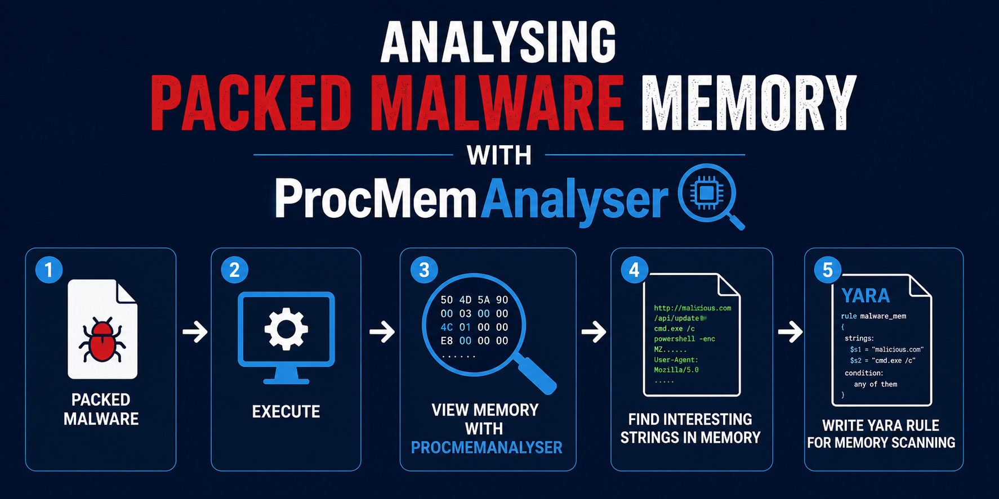
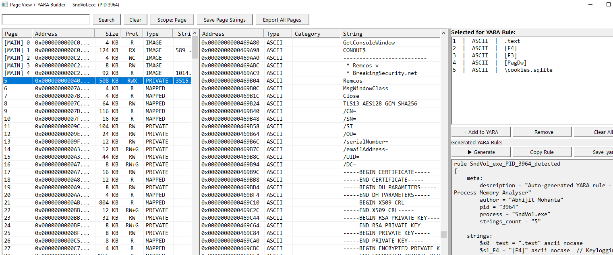

# ProcMemAnalyser



## Overview

ProcMemAnalyser is a Windows memory analysis tool designed to inspect the virtual memory of running processes, especially packed or malicious processes.

Traditional tools can display process memory, but identifying meaningful artifacts manually is time consuming. ProcMemAnalyser helps analysts quickly locate interesting strings, suspicious indicators, and memory artifacts that can be used for malware analysis, threat hunting, and YARA rule creation.

---

## Features

* View virtual memory of running processes
* Analyse packed malware memory
* Locate interesting strings automatically
* Extract suspicious artifacts from memory
* Detect URLs, domains, commands, and indicators
* Generate YARA rules from memory findings
* Assist malware hunting and detection engineering workflows

---

## Analysis Workflow

```text
Packed Malware
        ↓
Execute
        ↓
View Memory with ProcMemAnalyser
        ↓
Find Interesting Strings in Memory
        ↓
Write YARA Rule for Memory Scanning
```

---

## Screenshot

Place screenshots inside the `images` folder.

```text
images/
 ├── banner.png
 ├── screenshot1.png
 └── screenshot2.png
```

Example:



---

## Example Use Cases

* Packed malware analysis
* Memory forensics
* Malware configuration extraction
* IOC hunting
* Detection engineering
* Threat hunting
* YARA rule generation

---

## Demo Video

https://youtu.be/6QdspAKtT5Q

---

## Repository

https://github.com/amohanta/Detection_Engineering_Tools/tree/main/ProcMemoryAnalyser

---

## Why Memory Analysis?

Static analysis alone is often not enough for modern malware.

Memory analysis can reveal:

* Unpacked payloads
* Command strings
* URLs and domains
* Injected code
* Malware configurations
* Runtime artifacts hidden from disk analysis

---

## Requirements

* Windows
* Administrator privileges recommended

---

## Author

Abhijit Mohanta

---

## Tags

`malware-analysis` `memory-forensics` `reverse-engineering` `yara` `threat-hunting` `dfir` `windows-security`
