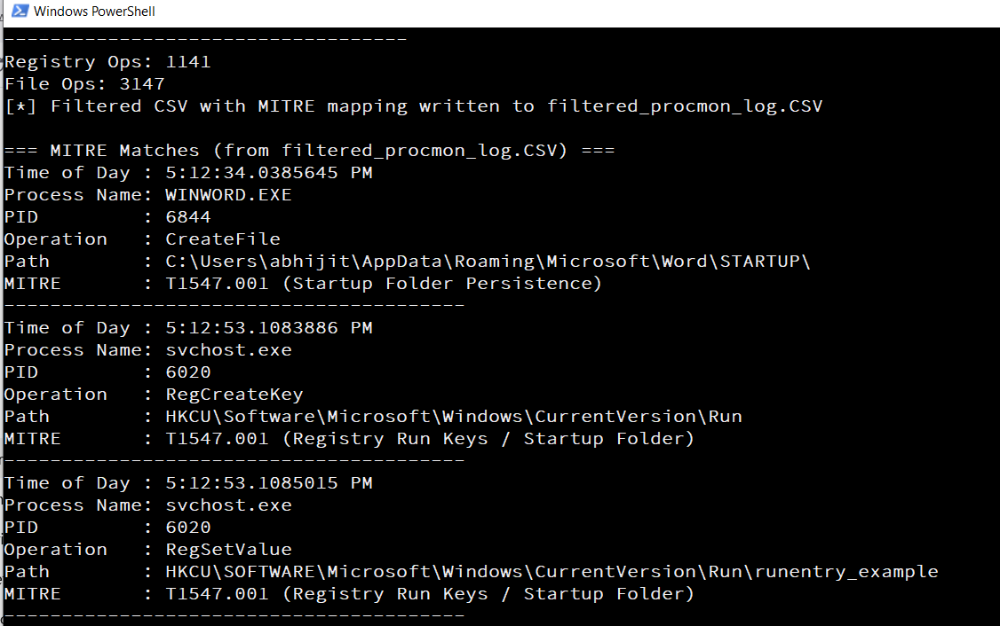

# Procmon Logs to MITRE Mapping

This project provides a **PowerShell script** to parse **Procmon logs (CSV format)** and map file/registry/network operations to relevant **MITRE ATT&CK techniques**.  
It is useful for malware analysis, detection engineering, and learning how attacker persistence/credential access techniques show up in real system activity.

---

## Features
- Parses **Procmon CSV logs**.
- Maps suspicious file/registry paths to **MITRE ATT&CK techniques**.
- Supports detection of persistence, credential theft, and other malware behaviors.
- Outputs cleanly formatted results.

---

## Workflow

1. **Run the malware sample** (in a safe lab environment).
2. **Capture logs with Procmon**.
   - Run Procmon and reproduce the activity.
   - Stop logging when done.
   - Save the log as **CSV format**.
3. **Pass the CSV file** to the PowerShell script:
   ```powershell
   .\ProcmonToMITRE.ps1 procmon_log.csv

**Screenshot**

