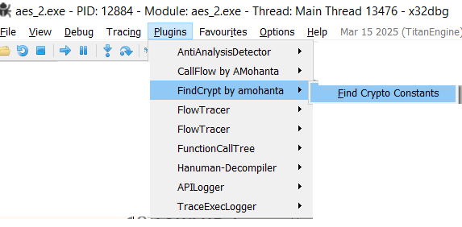
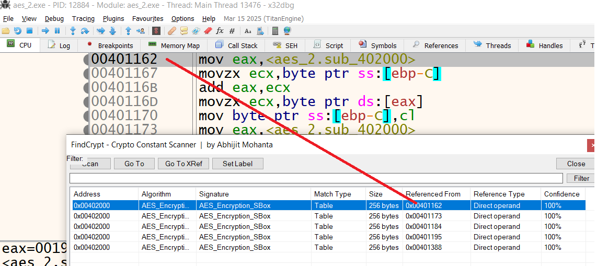

# FindCrypt for x64dbg

FindCrypt has been ported to x64dbg as a plugin for identifying cryptographic constants and algorithm-specific lookup tables within executable files.

## Screenshots

The tool helps malware analysts and reverse engineers quickly recognize cryptographic implementations during debugging. It displays detected constants, memory addresses, reference locations and match types, allowing users to navigate directly to the relevant code in x64dbg.

## Supported Algorithms

- AES
- DES
- Blowfish
- Camellia
- RC5 and RC6
- TEA and XXTEA
- Salsa20 and ChaCha
- MD5
- SHA-1
- SHA-224
- SHA-256
- SHA-512
- CRC32
- Adler-32
- xxHash32 and xxHash64
- zlib
- aPLib

The plugin supports both x32dbg and x64dbg.

