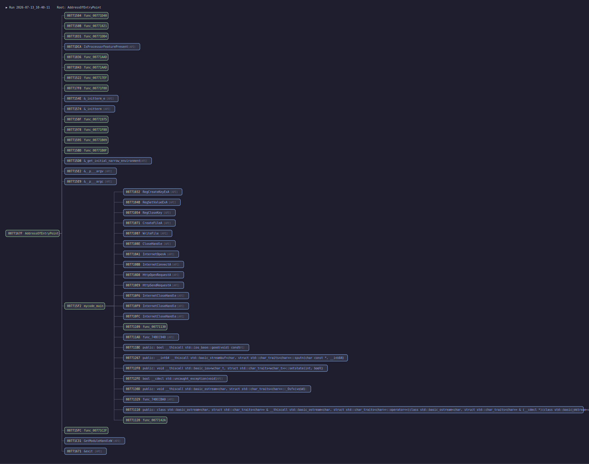

# CallFlow

An x64dbg plugin that traces execution flow and turns it into a readable **call tree** — stepping *over* API calls and *into* your own code, then logging the result as an interactive HTML page and an SVG flowchart.

> By **AMohanta** · closed-source · Windows (x32dbg / x64dbg)

*Example: a run starting at the entry point, showing `mycode_main` calling registry, file, and WinINet APIs. User-code calls are green, APIs are blue, and each row is prefixed with the address of the call instruction.*

---

## What it does

- Traces from the current instruction, **stepping over API calls** and **stepping into user-code calls**, so the tree stays focused on *your* program's logic.
- Resolves call targets, including **register / indirect calls** (e.g. `call esi` where a register holds a dynamically-loaded API pointer).
- Records the **call-instruction address** for every node, so you can jump straight to the call site.
- Writes output continuously, so a **crash still leaves a valid partial log**.

## Install

CallFlow ships as a prebuilt x64dbg plugin — no build step required.

1. Download the release for your architecture:
   - `CallFlow.dp32` — for **x32dbg** (32-bit targets)
   - `CallFlow.dp64` — for **x64dbg** (64-bit targets)
2. Copy it into the matching x64dbg **`plugins`** folder:
   - 32-bit: `x64dbg\release\x32\plugins\`
   - 64-bit: `x64dbg\release\x64\plugins\`
3. Start x64dbg (or **Plugins → Reload**). You should see **`CallFlow by AMohanta`** in the Plugins menu and a `CallFlow` load line in the log.

## Usage

1. Open your target in x64dbg and pause where you want the trace to begin (e.g. the entry point or a function of interest).
2. **Plugins → CallFlow by AMohanta → Start Trace.**
3. Let it run. Tracing ends automatically when the process exits, or choose **Stop Trace** to end it early.
4. Open the generated files (see below) next to the target `.exe`.

## Output

Files are written next to the traced executable (or to `%TEMP%` if that folder isn't writable). `<exe>` is the target name, `<date>_<time>` is the run start time.

| File | Description |
|------|-------------|
| `<exe>_<date>_<time>.html` | **Interactive call tree** for this run — expand/collapse nodes, color-coded user vs API, with call-site addresses. |
| `<exe>_<date>_<time>.svg`  | **Flowchart** of the same run (like the example above) — open in a browser, or import into Inkscape / draw.io as vectors. |
| `<exe>.html`               | **Cumulative log** — every run appended as its own section, so you can compare runs in one file. |

**Reading the tree/chart**

- 🟢 **Green** = user-code function (inside the main module).
- 🔵 **Blue `[API]`** = external / API call.
- 🟡 **Yellow address** = the address of the `call` instruction (the call site).

## Notes

- Works with both 32-bit and 64-bit targets (auto-detected).
- The per-run HTML and SVG are refreshed periodically during the trace and on exceptions, so if the target crashes you still get the flow **up to the point it ran**.
- Single-stepping a whole program is inherently slow; for large targets, start the trace at the function you care about rather than the entry point.

---

*CallFlow is distributed as a closed-source binary. For issues or feature requests, please open an issue.*
